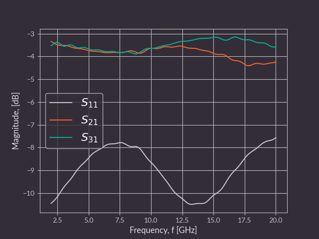
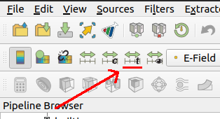

# OpenEMS simulation based on Gerber files
This project aims to streamline signal integrity simulations with Open source tools. It takes PCB production files as input (gerbers, drill files, stackup information) and using OpenEMS simulates SI performance of the traces.
## Installation
### Required dependencies
#### 1. [OpenEMS](https://www.openems.de/)


Install following packages (on Debian/Ubuntu):
```
build-essential cmake git libhdf5-dev libvtk9-dev libboost-all-dev libcgal-dev libtinyxml-dev qtbase5-dev libvtk9-qt-dev python3-numpy python3-matplotlib cython3 python3-h5py
```
Clone the repository, compile and install OpenEMS:
```
git clone --recursive https://github.com/thliebig/openEMS-Project.git
cd openEMS-Project
./update_openEMS.sh ~/opt/openEMS --python
```
#### 2. [Gerbv]()
On Ubuntu/Debian:
```
sudo apt install gerbv
```
### Optional dependecies
#### 1. [Paraview](https://www.paraview.org/)
On Ubuntu/Debian:
```
sudo apt install paraview
```

### Script installation
To install the script run:
```
pip install .
```
inside the repostiory
#### Virtual environment
If you want to install the script together with it's python dependencies inside a virtual environment follow these steps:
* Create virtual environment: `python -m venv .venv --system-site-packages`
* Activate the environment: `source .venv/bin/activate`
* Install script and it's python dependencies: `pip install .`
* Deactivate the environment: `deactivate`

If you still want the script to be accessible globally without having to manually enable the virtual environment create a bash script with following contents:
```
#!/usr/bin/env bash
/path/to/repository/.venv/bin/python3 /path/to/repository/src/main.py "$@"
```
Then:
* Mark it executable: `chmod +x ems-kicad.sh`
* Put it on yout PATH, e.g. `ln -sf "$(pwd)/ems-kicad.sh" "$HOME/.local/bin/ems-kicad"`

After that to run the script you can just call `ems-kicad` wherever you want to.


## Usage
For quick lookup use `ems-kicad --help`.
To simulate a trace you need to:
* Prepare input files and put them in `fab/` folder (described in detail [here](#pcb-input-files-preparation))
* Prepare config `simulation.json` file (described in detail [here](#config-preparation))
* Run `ems-kicad -a` (what happens during described [here](#geometry-creation))
* View the results in `ems/results` (described in detail [here](#results))


## Results
This software returns following types of output:
#### Impedance chart
Plot of each excited port vs frequency


#### S-parameter chart
Plot of each S-parameter measured during each excitation


#### Smith chart
Plot of S-11 parameter for each excitation


#### S-parameter and impedance data
Impedance and S-parameter data gathered during the simulations. Stored in CSV format with a header.

## How it works
### Project preparation
Simulating the whole PCB is extremaly resource intensive, therefore separating the region of interest is very important. Size should be as small as possible. Uneeded traces, pours etc. should be removed. If whole layers are unneeded they can be removed in later steps.

* Ports of interest should be marked using special simulation port footprint. Rotation and position should be appropriate. (It's reference number tells the simulator which port to assign to it).

* Origin point for drill files should be placed in bottom-left corner.

* Every trace, pour that is somehow terminated in reality and will exist in the simulation should also be terminated using simulation port or connected to ground.

* For now, capacitors are not simulated and for high frequency simulation they can be aproximated by shorting them using a trace.

### PCB Input Files preparation

This script requires multiple input files for geometry creation. They should all reside in "fab" folder and are listed below:
* Gerber files - Each simulated copper layer should have a gerber file. Name should be in the following format: "\<optional-text\>-\<name-from-stackup-file\>.gbr"
* Stackup file - File describing PCB stackup. Name should be "stackup.json". Example format:
```
{
    "layers": [
        {
            "name": "F.Cu",
            "type": "copper",
            "color": null,
            "thickness": 0.035,
            "material": null,
            "epsilon": null,
            "lossTangent": null
        },
        {
            "name": "dielectric 1",
            "type": "core",
            "color": null,
            "thickness": 0.2,
            "material": "FR4",
            "epsilon": 4.5,
            "lossTangent": 0.02
        }
    ],
    "format_version": "1.0"
}
```
* Drill file - Drill file in excellon format with plated through-holes. Filename should end with "-PTH.drl"
* Position file - File describing positions of ports. Filename should end with "-pos.csv". Example line:
```
# Ref     Val              Package                PosX       PosY       Rot  Side
SP1       Simulation_Port  Simulation_Port      3.0000    11.7500  180.0000  top
```

### Config preparation
`simulation.json` file configures the whole simulation. Example files can be found in `example_gerbers` folder. All dimensions in this file are specified in **micrometers**. There are a few sections to this config file:
##### Miscellaneous
* `format_version` - specifies with which format the config file was written. When writing a new config this should be the newest supported version (this number can be found in `constants.py` file).
* `frequency` - `start` specifies the lowest frequency of interest and `stop` the highest (in MHz).
* `max_steps` - max number of simulation steps after which the simulation will stop, no matter what.
* `via/plating_thickness` - thickness of via plating (micrometers).
* `via/filling_epsilon` - dielectric constant of the material the vias are filled in with. If they are not filled in, it should be 1.
* `margin/xy` - margin (area added outside the board) size in x and y directions (micrometers).
* `margin/z` - margin size in z direction (micrometers).
##### Mesh
* `xy` - mesh grid pitch in x and y direction (micrometers).
* `inter_layers` - number of mesh lines in z direction between neighbouring pcb layers.
* `margin/xy` - mesh grid pitch in x and y direction (micrometers) outside of the board area.
* `margin/z` - mesh grid pitch in z direction (micrometers) outside of the board area.
##### Ports
`ports` is a list of ports. Each port has multiple parameters:
* `width` - width of the port (micrometers).
* `length` - length of the port (right now port are fragments of microstriplines. Their length should be at least 8x mesh cell size) (micrometers).
* `impedance` - terminating impedance of the port (impedance of driver or receiver) (Ohms).
* `layer` - copper layer number on which the port is (counting from the top).
* `plane` - copper layer number on which reference plane of the microstrip is (counting from the top).
* `excite` - whether simulator should use this port as an input port. (if there are multiple excited ports, they will be excited in separate simulations)

### Geometry creation
This is an automatic step done with `-g` flag.
Script locates all the files needed for creating the geometry. (gerbers, drill files, pnp files, stackup file, simulation config file). After that it converts gerbers to png's using gerbv. Then the PNG's are processed into triangles and input into the geometry. It also adds via geometries as well as port geometries. Everything is placed on correct Z heights using the stackup file.

You can view the generated geometry which is saved to `ems/geometry/geometry.xml` file using AppCSXCAD app which was installed during OpenEMS installation.

### Simulation
This is an automatic step done with `-s` flag.
Script loads the geometry and config files. It inputs all the information into the engine and starts the simulations, iterating over every "excited" port.

User should verify if selected number of timesteps is enough. The engine recommends that it should be at least 3x as long as the pulse:
```
Excitation signal length is: 3211 timesteps (3.18343e-10s)
Max. number of timesteps: 10000 ( --> 3.11429 * Excitation signal length)
```

Simulator converts the geometry into voxels then starts solving the Maxwell equations for each edge in the mesh. It does that for a number of timesteps (maximum number specified in config) and then exits. For each timestep electric field date from planes between copper planes is saved to files in `ems/simulation` folder. Port voltage and current data is also saved.

During the simulation one of the ports is exited using a gaussian pulse (wideband frequency content). This pulse traverses the network and exits using ports (it can also get emitted outside of the board). 

You can monitor the simulation looking at the engine output:
```
[@ 20s] Timestep: 4620 || Speed:  294.4 MC/s (3.372e-03 s/TS) || Energy: ~4.16e-16 (- 7.15dB)
```
You can see what timestep are you on. How many mesh voxels per second the simulator processes. How much energy is left in the system. The energy should drop during the simulation as it exits through the ports (after the excitation pulse ends). However due to inaccuracies and energy radiated it won't drop to 0.

After the simulation finishes, user can verify using `Paraview` if it makes sense. How to do this is described later.

### Postprocessing
This is an automatic step done with `-p` flag.
Scripts loads in the simulator data for each excited port. Then it computes an FFT to get data in frequency domain. It then converts the incident and reflected wave data to impedance and S parameters. Those are saved in csv format in `ems/results/S-parameters` folder. This data is also automatically ploted and those plots are saved to `ems/results`


## Paraview
To view simulation data in Paraview follow these steps:
* Open Paraview
* Load the data you are interested in (File->Open...). The files are located in `ems/simulation/<port_number>/e_field_<layer_number>_..vtr`
* Show loaded in data. Eye symbol in `Pipeline Browser` on the left side of the window.


* Change `Coloring` to `E-Field`. Properties window on the left side.


* Rescale to data range. Second icon bar from the top.



* Press Play to play the animation. First icon bar from the top.

